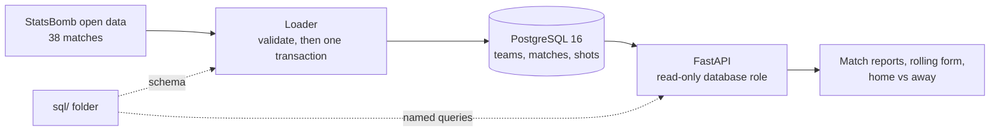
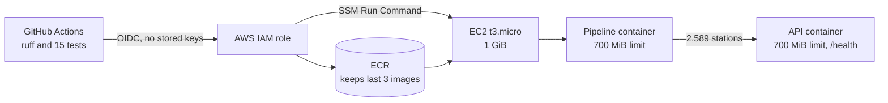

<h1 align="center">Hi, I'm Omar 👋</h1>

  <strong>Self-taught engineer building data pipelines, APIs and cloud deployments</strong> 
  London, UK · Seeking <strong>entry-level technology roles</strong>

  
  

---

## 👤 About me

- **Background:** 19 months as a **design engineering apprentice** before moving into tech.
- **Self-study:** I started learning **computer science fundamentals in December 2025**, alongside that apprenticeship, and have been **building projects since June 2026**.
- **What I've built:** **two complete projects** that take real public data, check it, store it and make it available through a web API. One of them **runs on Amazon Web Services (AWS)** and **deploys itself automatically** every time I push a change.
- **How I work:** every change is **checked by automated tests**, I **write down the main decisions and why I made them**, and I keep **screenshots as evidence** that each system works.

**Start here:** [MatchLens](https://github.com/OmarM-Devv/matchlens-analysis) for a football data engine, then [Rail data pipeline and API](https://github.com/OmarM-Devv/rail-data-pipeline-api) a cloud environment for real-time travel streams.

---

## 🚀 Projects

| Project | What it is, in plain English | Main skills |
|---|---|---|
| **[MatchLens](https://github.com/OmarM-Devv/matchlens-analysis)** | Loads all **1,042 shots** from Leicester City's **38 matches** in their 2015/16 title-winning season into a database, and turns them into match reports and form tables | **SQL**, PostgreSQL, Python, FastAPI, Docker, automated tests |
| **[Rail data pipeline and API](https://github.com/OmarM-Devv/rail-data-pipeline-api)** | Cleans official figures on how many people use each of Great Britain's **2,589 railway stations**, and serves them online from **AWS**, redeploying itself on every change | Python, pandas, **AWS**, **Terraform**, Docker, **CI/CD** |
| **[Rail station usage pipeline](https://github.com/OmarM-Devv/rail-data-pipeline)** | The first version of the rail project: downloads, cleans and checks the data | Python, pandas, data cleaning |
| **[AWS EC2 web server lab](https://github.com/OmarM-Devv/aws-ec2-ubuntu-web-server-lab)** | Set up a Linux web server in the cloud, locked down who could reach it, tested it and removed it afterwards | AWS, Linux, SSH, networking |
| **[Linux SSH lab](https://github.com/OmarM-Devv/linux-ssh-verification-lab)** | Connected two virtual machines, switched a remote-login service on and off, and checked it from the other machine | Linux, networking, Nmap |

### [MatchLens](https://github.com/OmarM-Devv/matchlens-analysis): football analysis on a database

**In short:** I took StatsBomb's free match data for Leicester City's 2015/16 Premier League season, loaded it into a PostgreSQL database and built a small web app that reports on each match, rolling form and home vs away results. It runs on my own machine in Docker; it isn't deployed online.

- **Safe data loading:** the data is **checked before anything is saved**. If anything goes wrong, **nothing is saved**, so the database is never left half-updated.
- **Analysis in SQL:** form and home vs away results are **calculated in SQL**, and **tests check the totals are right**.
- **Tested on every change:** **16 automated tests** run against a real database each time I push code.

<strong>Technical details</strong> (architecture and design decisions)

 

- **Transaction boundaries:** each import is validated first, then written in one PostgreSQL transaction under an advisory lock. A failure rolls everything back, and two imports at once queue instead of clashing. ([ADR 0001](https://github.com/OmarM-Devv/matchlens-analysis/blob/main/docs/adr/0001-single-transaction-with-advisory-lock.md))
- **Query layer isolation:** the schema and named queries live in `sql/`. The Python app loads them by name and contains no SQL of its own. ([ADR 0004](https://github.com/OmarM-Devv/matchlens-analysis/blob/main/docs/adr/0004-keep-sql-in-named-sql-files.md))
- **Window functions, measured:** rolling form uses `ROWS` window frames, shots are aggregated before joining so points are never double-counted, and query plans were checked with `EXPLAIN ANALYZE`. ([ADR 0003](https://github.com/OmarM-Devv/matchlens-analysis/blob/main/docs/adr/0003-aggregate-shots-before-joining.md))
- **Error handling:** a shot missing its xG value is set aside and logged instead of failing the whole batch. Anything else malformed rejects the snapshot before a single row is written. ([ADR 0002](https://github.com/OmarM-Devv/matchlens-analysis/blob/main/docs/adr/0002-set-aside-shots-missing-xg.md))
- **Tested and drilled:** 16 integration tests (31 assertions) against real PostgreSQL in CI, and a recorded outage exercise that found and fixed a 130-second hang.

### [Rail data pipeline and API](https://github.com/OmarM-Devv/rail-data-pipeline-api): data pipeline deployed on AWS

**In short:** I took the Office of Rail and Road's station usage figures (April 2024 to March 2025), cleaned and checked them, and deployed an API that answers questions such as "which are the busiest stations?". It runs on an AWS server, and GitHub deploys every change to it automatically.

**Live demo:** [health check](http://16.61.66.47:8000/health) · [API docs](http://16.61.66.47:8000/docs). This demo may be switched off to save costs; the repository keeps screenshots of it running.

- **Runs in the cloud:** the server and everything around it are **defined in code with Terraform**, so the whole setup can be rebuilt the same way every time.
- **Deploys itself safely:** every change is **tested, packaged and deployed automatically**. If the new version fails its health check, it **rolls back to the previous one**.
- **No stored passwords:** GitHub gets **short-lived AWS access** for each deploy, so **no AWS keys are kept** in the repository.

<strong>Technical details</strong> (architecture and design decisions)

 

- **Multi-container deploys:** each deploy runs a one-off pipeline container to refresh the data, then replaces the API container, waits for `/health`, and rolls back automatically if the check fails. ([ADR 0001](https://github.com/OmarM-Devv/rail-data-pipeline-api/blob/main/docs/adr/0001-deploy-with-ssm-run-command.md))
- **Sized to the hardware:** a `t3.micro` (1 GiB) locked in by a Terraform validation rule, a 700 MiB memory limit on each container, and an ECR policy that keeps only the last 3 images. ([ADR 0003](https://github.com/OmarM-Devv/rail-data-pipeline-api/blob/main/docs/adr/0003-single-t3-micro-with-docker.md))
- **Keyless cloud identity:** GitHub Actions gets short-lived AWS credentials through OIDC. The IAM trust policy is pinned to GitHub's immutable subject claim, which uses numeric owner and repository IDs, so only `main` of this repository can deploy. ([ADR 0002](https://github.com/OmarM-Devv/rail-data-pipeline-api/blob/main/docs/adr/0002-github-oidc-with-immutable-subject.md))
- **Windows-safe infrastructure:** Terraform strips Windows line endings from the server's start-up script, so a checkout on Windows doesn't make Terraform replace the server.
- **Verified data on every deploy:** the pipeline validates the whole dataset before writing and replaces files atomically. The deploy log records 2,589 stations and 7,767 ticket rows, and `/health` reports the rows loaded. ([ADR 0004](https://github.com/OmarM-Devv/rail-data-pipeline-api/blob/main/docs/adr/0004-validate-before-writing-keep-last-good-data.md))

---

## 🛠️ Tech stack

  
  
  
  
  
  
  
  
  
  
  
  

<strong>Where I've used each tool</strong>

 

| Area | Tools | Where I've used them |
|---|---|---|
| Languages | Python, SQL | Both main projects |
| Data | pandas, PostgreSQL 16, SQLAlchemy 2.0 | Rail pipeline cleaning and reshaping; MatchLens schema, loader and queries |
| APIs | FastAPI, Pydantic, Jinja2 | Both main projects |
| Testing and quality | pytest, pytest-cov, ruff | MatchLens: 16 integration tests. Rail: 15 tests, 85% coverage, lint and format checks |
| Containers | Docker, Docker Compose | Multi-stage, non-root images; a hardened Compose stack |
| Infrastructure as code | Terraform | EC2, ECR, IAM, the GitHub OIDC provider and security groups |
| AWS | EC2, ECR, IAM, Systems Manager, Elastic IP | Rail deployment; EC2 web server lab |
| CI/CD | GitHub Actions, OIDC | Tests on every push; build, push and deploy on `main` |
| Linux and networking | Ubuntu, systemctl, SSH, Nmap, VirtualBox | Linux SSH and AWS EC2 labs |

---

## 📅 Self-study timeline

| Date | Milestone |
|---|---|
| 15/12/2025 | **[Configuration management notes](https://github.com/OmarM-Devv/Configuration-Management):** my first repository. I edited XML configuration files to map image files to database IDs and correct data, and learned how configuration drives software |
| 20/06/2026 – 07/09/2026 | **Built my first coding project in a private repository**, a rail station usage pipeline in Python and pandas, over about 11 weeks. I **published it once it was working**: [rail-data-pipeline](https://github.com/OmarM-Devv/rail-data-pipeline) |
| 05/09/2026 | **[Linux SSH lab](https://github.com/OmarM-Devv/linux-ssh-verification-lab):** VirtualBox, Kali, Ubuntu, Nmap and systemctl |
| 06/09/2026 | **[AWS EC2 web server lab](https://github.com/OmarM-Devv/aws-ec2-ubuntu-web-server-lab):** SSH, Apache, security groups and clean-up |
| 09/2026 | **Built MatchLens, and the rail project's API and tests, locally** over about four weeks |
| 28/09/2026 | **Published my two main projects**, [MatchLens](https://github.com/OmarM-Devv/matchlens-analysis) and [Rail data pipeline and API](https://github.com/OmarM-Devv/rail-data-pipeline-api), and **deployed the rail API to AWS**. The first deploy failed because the AWS trust policy didn't match GitHub's login token; I diagnosed it, updated the policy and redeployed the same evening |

## 📚 Currently learning

- **Python and pandas:** cleaning, reshaping and checking data, and explaining my code clearly.
- **SQL and PostgreSQL:** designing tables, window functions and reading query plans.
- **Docker and Terraform:** building container images and defining cloud infrastructure in code.
- **AWS:** EC2, IAM and security-group rules, and cleaning up resources I no longer need.
