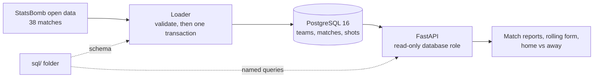
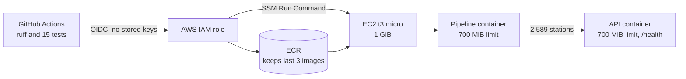

# Omar Mohamed

**Self-taught engineer working across software, data and DevOps · London, UK**

Former building services engineering apprentice, now applying for software engineering, data engineering and DevOps apprenticeships. I started learning computer science fundamentals in December 2025, alongside my apprenticeship, and have been building projects since June 2026.

## What I build

I build small, complete systems and write down the decisions behind them. Data is validated before it is stored, every change runs through automated tests, and infrastructure is defined in code.

- **Software engineering:** separate layers for SQL, loading and the API; validation before any write; integration tests against a real PostgreSQL database; architecture decision records for the main trade-offs.
- **Data engineering:** guarded, repeatable batch loads; SQL with window functions and aggregate-before-join queries, checked with `EXPLAIN ANALYZE`; pandas cleaning, reshaping and schema validation.
- **DevOps:** AWS defined in Terraform, keyless OIDC deploys from GitHub Actions, containers capped at 700 MiB on a 1 GiB `t3.micro`, and health-checked deploys with automatic rollback.

**Start here:** [MatchLens](https://github.com/OmarM-Devv/matchlens-analysis) for data and software engineering, then [Rail data pipeline and API](https://github.com/OmarM-Devv/rail-data-pipeline-api) for DevOps.

## Systems

### [MatchLens](https://github.com/OmarM-Devv/matchlens-analysis): football analysis on PostgreSQL

Descriptive analysis of Leicester City's 2015/16 Premier League season from StatsBomb open data: 38 matches and 1,042 shot events. It runs locally under Docker Compose and is tested in CI on every push; it is not deployed.

- **Transaction boundaries:** each import is validated first, then written in one PostgreSQL transaction under an advisory lock. A failure rolls everything back, and two imports at once queue instead of clashing. ([ADR 0001](https://github.com/OmarM-Devv/matchlens-analysis/blob/main/docs/adr/0001-single-transaction-with-advisory-lock.md))
- **Query layer isolation:** the schema and named queries live in `sql/`. The Python app loads them by name and contains no SQL of its own. ([ADR 0004](https://github.com/OmarM-Devv/matchlens-analysis/blob/main/docs/adr/0004-keep-sql-in-named-sql-files.md))
- **Window functions, measured:** rolling form uses `ROWS` window frames, shots are aggregated before joining so points are never double-counted, and query plans were checked with `EXPLAIN ANALYZE`. ([ADR 0003](https://github.com/OmarM-Devv/matchlens-analysis/blob/main/docs/adr/0003-aggregate-shots-before-joining.md))
- **Error handling:** a shot missing its xG value is set aside and logged instead of failing the whole batch. Anything else malformed rejects the snapshot before a single row is written. ([ADR 0002](https://github.com/OmarM-Devv/matchlens-analysis/blob/main/docs/adr/0002-set-aside-shots-missing-xg.md))
- **Tested and drilled:** 16 integration tests (31 assertions) against real PostgreSQL in CI, and a recorded outage exercise that found and fixed a 130-second hang.

### [Rail data pipeline and API](https://github.com/OmarM-Devv/rail-data-pipeline-api): data pipeline deployed on AWS

Cleans the Office of Rail and Road's station usage data (2,589 stations, April 2024 to March 2025) and serves it through a REST API, deployed to AWS by GitHub Actions.

**Live demo:** [health check](http://16.61.66.47:8000/health) · [API docs](http://16.61.66.47:8000/docs). This is a demo stack that may be taken down to save costs; the repository keeps screenshots as evidence.

- **Multi-container deploys:** each deploy runs a one-off pipeline container to refresh the data, then replaces the API container, waits for `/health`, and rolls back automatically if the check fails. ([ADR 0001](https://github.com/OmarM-Devv/rail-data-pipeline-api/blob/main/docs/adr/0001-deploy-with-ssm-run-command.md))
- **Sized to the hardware:** a `t3.micro` (1 GiB) locked in by a Terraform validation rule, a 700 MiB memory limit on each container, and an ECR policy that keeps only the last 3 images. ([ADR 0003](https://github.com/OmarM-Devv/rail-data-pipeline-api/blob/main/docs/adr/0003-single-t3-micro-with-docker.md))
- **Keyless cloud identity:** GitHub Actions gets short-lived AWS credentials through OIDC. The IAM trust policy is pinned to GitHub's immutable subject claim, which uses numeric owner and repository IDs, so only `main` of this repository can deploy. ([ADR 0002](https://github.com/OmarM-Devv/rail-data-pipeline-api/blob/main/docs/adr/0002-github-oidc-with-immutable-subject.md))
- **Windows-safe infrastructure:** the server's start-up script strips Windows line endings, so a checkout on Windows doesn't make Terraform replace the server.
- **Verified data on every deploy:** the pipeline validates the whole dataset before writing and replaces files atomically. The deploy log records 2,589 stations and 7,767 ticket rows, and `/health` reports the rows loaded. ([ADR 0004](https://github.com/OmarM-Devv/rail-data-pipeline-api/blob/main/docs/adr/0004-validate-before-writing-keep-last-good-data.md))

### Evidence by apprenticeship standard

Mapped against skills described in the [Skills England](https://skillsengland.education.gov.uk/apprenticeships/) occupational standards, to show where to find the evidence. It is not a claim to have completed them.

| Standard | Skills it describes | Where to look |
|---|---|---|
| Software developer (Level 4) | Linking code to data sets; unit and integration testing; building and deploying code | MatchLens loader and its 16 integration tests; Rail API tests and CI/CD workflow |
| Data engineer (Level 5) | Cleaning and validating data at each stage of ETL; querying with SQL and Python, with automated validation checks; technical documentation | Rail pipeline validation; MatchLens `sql/` queries and count guards; both READMEs and their ADRs |
| DevOps engineer (Level 4) | Infrastructure as code; release automation from source control to users; cloud security techniques | Rail `terraform/`, deploy workflow, OIDC trust policy, IMDSv2 and least-privilege IAM |

## Toolstack

| Area | Tools | Where I've used them |
|---|---|---|
| Languages | Python, SQL | Both systems |
| Data | pandas, PostgreSQL 16, SQLAlchemy 2.0 | Rail pipeline cleaning and reshaping; MatchLens schema, loader and queries |
| APIs | FastAPI, Pydantic, Jinja2 | Both systems |
| Testing and quality | pytest, pytest-cov, ruff | MatchLens: 16 integration tests. Rail: 15 tests, 85% coverage, lint and format checks |
| Containers | Docker, Docker Compose | Multi-stage, non-root images; a hardened Compose stack |
| Infrastructure as code | Terraform | EC2, ECR, IAM, the GitHub OIDC provider and security groups |
| AWS | EC2, ECR, IAM, Systems Manager, Elastic IP | Rail deployment; EC2 web server lab |
| CI/CD | GitHub Actions, OIDC | Tests on every push; build, push and deploy on `main` |
| Linux and networking | Ubuntu, systemctl, SSH, Nmap, VirtualBox | Linux SSH and AWS EC2 labs |

## Self-study timeline

| Date | Milestone |
|---|---|
| 20/06/2026 | Started the rail station usage pipeline in Python and pandas (first version, in a private repository) |
| 05/09/2026 | [Linux SSH service verification lab](https://github.com/OmarM-Devv/linux-ssh-verification-lab): VirtualBox, Kali, Ubuntu, Nmap and systemctl |
| 06/09/2026 | [AWS EC2 Ubuntu web server lab](https://github.com/OmarM-Devv/aws-ec2-ubuntu-web-server-lab): SSH, Apache, security groups and clean-up |
| 07/09/2026 | Published the [rail station usage pipeline](https://github.com/OmarM-Devv/rail-data-pipeline) |
| 28/09/2026 | Published [rail-data-pipeline-api](https://github.com/OmarM-Devv/rail-data-pipeline-api) and [matchlens-analysis](https://github.com/OmarM-Devv/matchlens-analysis) |

## Currently learning

- **Python and pandas:** data cleaning, reshaping and validation, and explaining my code clearly.
- **SQL and PostgreSQL:** schema design, constraints, window functions and reading query plans.
- **Docker and Terraform:** building container images and defining cloud infrastructure as code.
- **AWS:** EC2, IAM and security-group rules, and cleaning up temporary resources.
